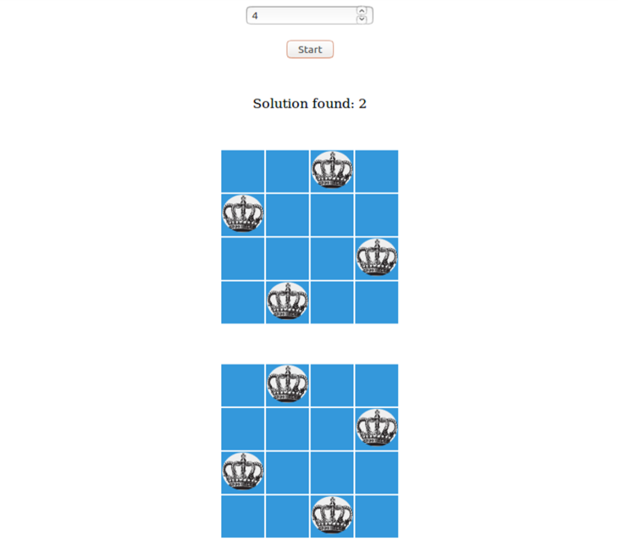

# Visualize_N_Queen
Implementing visual the algorithm for resolve n-queens problem in Javascript  
Simple file html with html, js, css

## Usage

CLI:
  *  -Mac: open index.html
  *  -Linux: xdg-open index.html  

